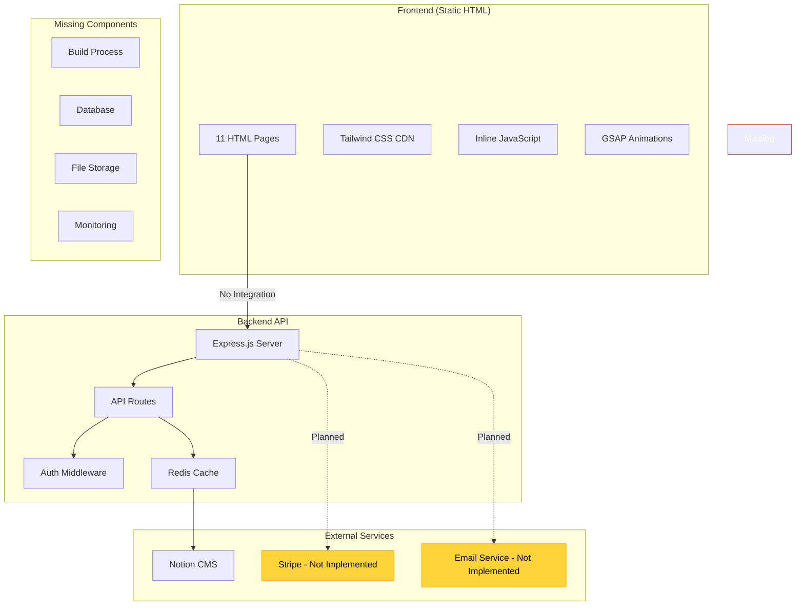
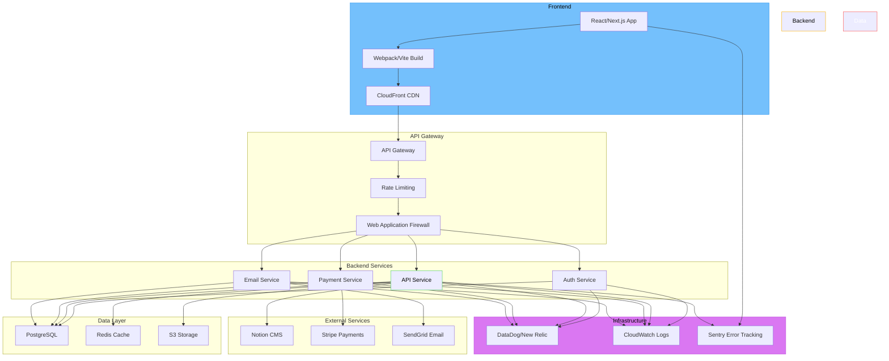
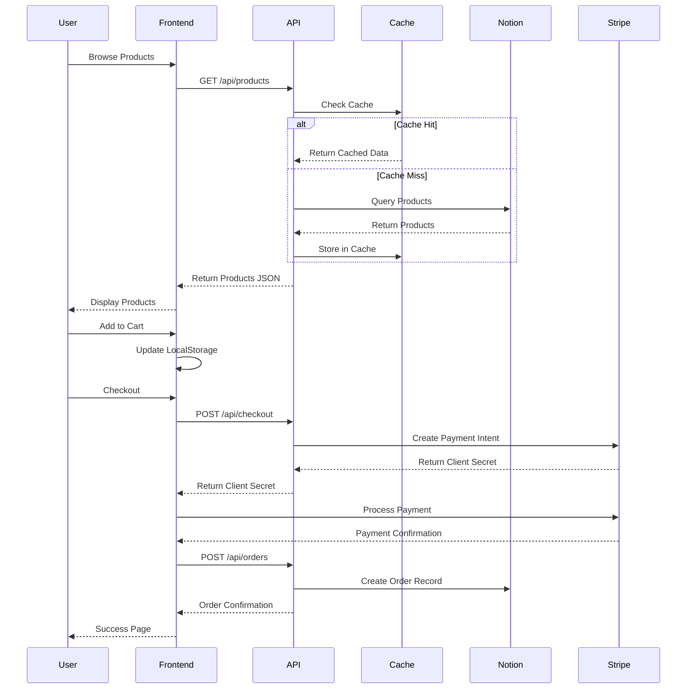
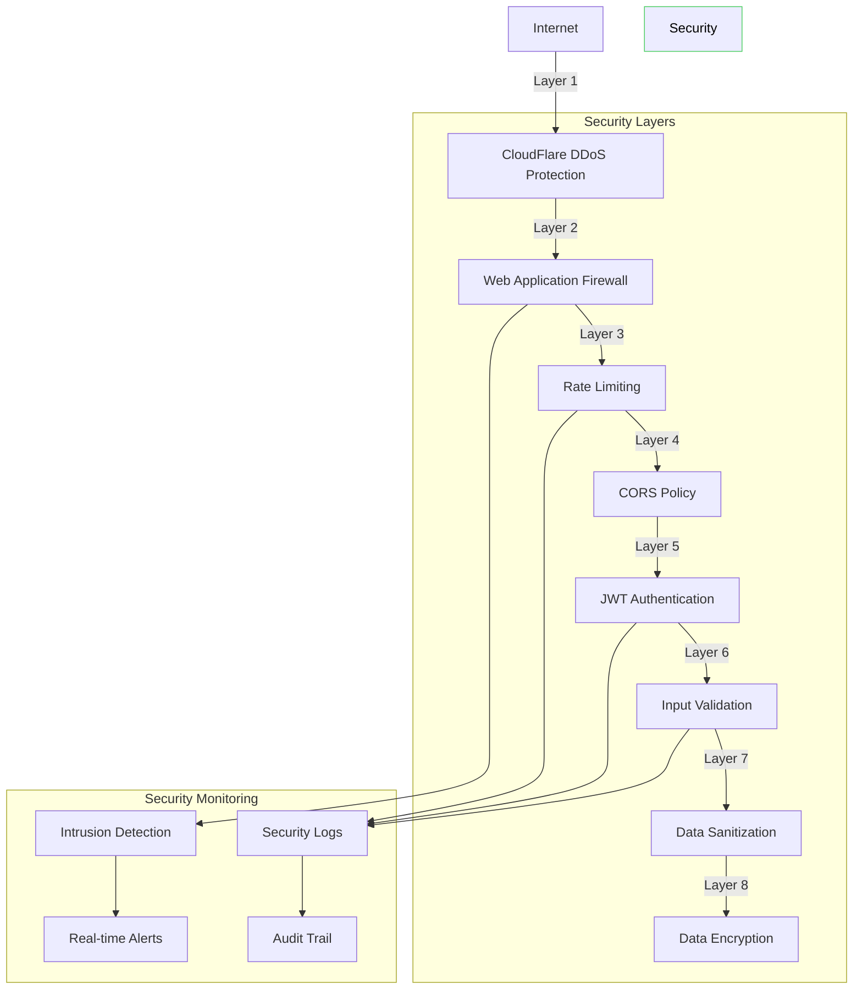

# Ultra Black Run Club - Architecture Diagram

## Current Architecture



## Recommended Architecture



## Data Flow Diagram



## Security Architecture



## Deployment Pipeline

```mermaid
graph LR
    subgraph "Development"
        Dev[Local Development]
        Test[Unit Tests]
        Lint[ESLint/Prettier]
    end

    subgraph "CI/CD"
        GitHub[GitHub]
        Actions[GitHub Actions]
        Build[Build & Test]
        Security[Security Scan]
    end

    subgraph "Environments"
        Staging[Staging]
        Prod[Production]
    end

    subgraph "Monitoring"
        Health[Health Checks]
        Metrics[Performance Metrics]
        Errors[Error Tracking]
    end

    Dev --> Test
    Test --> Lint
    Lint --> GitHub
    GitHub --> Actions
    Actions --> Build
    Build --> Security
    Security -->|Pass| Staging
    Staging -->|Manual Approval| Prod
    
    Staging --> Health
    Prod --> Health
    Health --> Metrics
    Metrics --> Errors

    style Development fill:#74c0fc,stroke:#339af0,color:#000
    style CI/CD fill:#ffd43b,stroke:#fab005,color:#000
    style Environments fill:#69db7c,stroke:#51cf66,color:#000
    style Monitoring fill:#da77f2,stroke:#be4bdb,color:#000